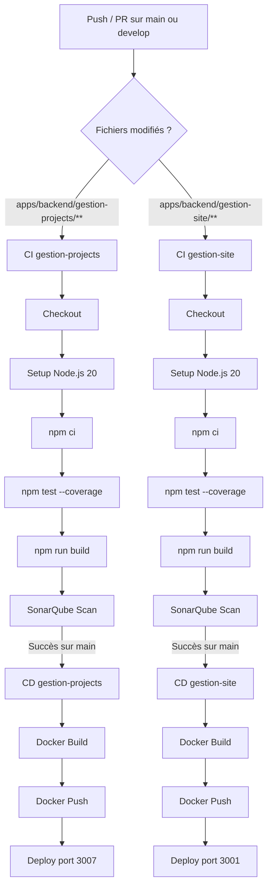
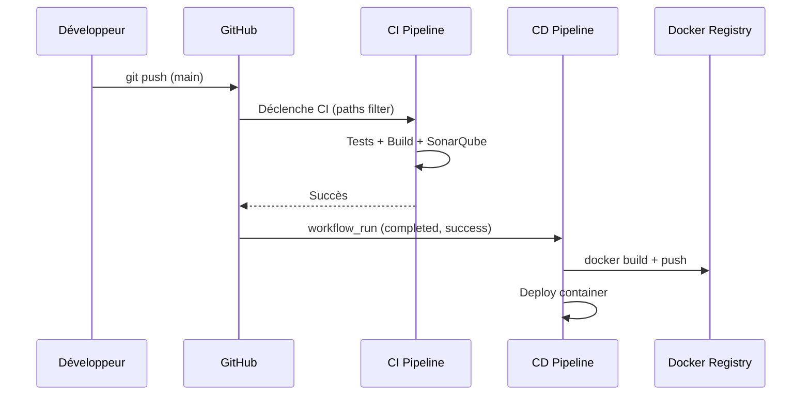

# Document de Conception — CI/CD pour gestion-projects et gestion-site

## Vue d'ensemble

Ce document décrit la conception technique des pipelines CI/CD pour les microservices **gestion-projects** (port 3007) et **gestion-site** (port 3001) du monorepo SmartSite. Les pipelines sont implémentés avec **GitHub Actions** et couvrent l'intégration continue (CI) et le déploiement continu (CD) pour chaque service de manière indépendante.

### Objectifs

- Automatiser la validation du code (tests, build, analyse qualité) à chaque push ou pull request.
- Produire des images Docker optimisées et les pousser vers un registre.
- Déclencher le déploiement automatiquement après un CI réussi sur `main`.
- Garantir la sécurité des secrets et la traçabilité des déploiements.

### Contraintes techniques

- Monorepo : les deux services cohabitent sous `apps/backend/`. Les pipelines doivent se déclencher uniquement sur les modifications du service concerné.
- NestJS avec Jest pour les tests unitaires.
- Node.js 20 comme version cible.
- MongoDB comme base de données (connexion via `MONGODB_URI`).
- SonarQube pour l'analyse statique de la qualité du code.

---

## Architecture

### Vue globale du pipeline



### Déclenchement conditionnel

Le déclenchement conditionnel par `paths` est la clé pour éviter des exécutions inutiles dans un monorepo. Chaque workflow CI surveille uniquement son répertoire de service. Le workflow CD est déclenché par l'événement `workflow_run` du CI correspondant, garantissant que le déploiement ne se produit qu'après une validation complète.



---

## Composants et Interfaces

### 1. Fichiers Workflow GitHub Actions

Quatre fichiers YAML dans `.github/workflows/` :

| Fichier | Type | Service | Déclencheur |
|---|---|---|---|
| `ci-gestion-projects.yml` | CI | gestion-projects | push/PR sur main/develop, paths: `apps/backend/gestion-projects/**` |
| `ci-gestion-site.yml` | CI | gestion-site | push/PR sur main/develop, paths: `apps/backend/gestion-site/**` |
| `cd-gestion-projects.yml` | CD | gestion-projects | `workflow_run` de `ci-gestion-projects` (completed, success, branch: main) |
| `cd-gestion-site.yml` | CD | gestion-site | `workflow_run` de `ci-gestion-site` (completed, success, branch: main) |

#### Structure type d'un workflow CI

```yaml
name: CI gestion-projects

on:
  push:
    branches: [main, develop]
    paths:
      - 'apps/backend/gestion-projects/**'
  pull_request:
    branches: [main, develop]
    paths:
      - 'apps/backend/gestion-projects/**'

jobs:
  ci:
    runs-on: ubuntu-latest
    defaults:
      run:
        working-directory: apps/backend/gestion-projects

    steps:
      - uses: actions/checkout@v4

      - name: Setup Node.js 20
        uses: actions/setup-node@v4
        with:
          node-version: '20'
          cache: 'npm'
          cache-dependency-path: apps/backend/gestion-projects/package-lock.json

      - name: Installer les dépendances
        run: npm ci

      - name: Exécuter les tests unitaires avec couverture
        run: npm test -- --coverage --coverageReporters=lcov

      - name: Build NestJS
        run: npm run build

      - name: Analyse SonarQube
        uses: SonarSource/sonarqube-scan-action@v5
        with:
          projectBaseDir: apps/backend/gestion-projects
        env:
          SONAR_TOKEN: ${{ secrets.SONAR_TOKEN }}
          SONAR_HOST_URL: ${{ secrets.SONAR_HOST_URL }}
```

#### Structure type d'un workflow CD

```yaml
name: CD gestion-projects

on:
  workflow_run:
    workflows: ["CI gestion-projects"]
    types: [completed]
    branches: [main]

jobs:
  cd:
    runs-on: ubuntu-latest
    if: ${{ github.event.workflow_run.conclusion == 'success' }}

    steps:
      - uses: actions/checkout@v4

      - name: Authentification Docker Registry
        uses: docker/login-action@v3
        with:
          username: ${{ secrets.DOCKER_USERNAME }}
          password: ${{ secrets.DOCKER_PASSWORD }}

      - name: Build et Push Docker Image
        uses: docker/build-push-action@v5
        with:
          context: apps/backend/gestion-projects
          file: apps/backend/gestion-projects/Dockerfile
          push: true
          tags: |
            ${{ secrets.DOCKER_USERNAME }}/gestion-projects:latest
            ${{ secrets.DOCKER_USERNAME }}/gestion-projects:${{ github.sha }}

      - name: Déploiement
        run: |
          docker pull ${{ secrets.DOCKER_USERNAME }}/gestion-projects:latest
          docker stop gestion-projects || true
          docker rm gestion-projects || true
          docker run -d \
            --name gestion-projects \
            -p 3007:3007 \
            -e PORT=3007 \
            -e MONGODB_URI=${{ secrets.MONGODB_URI }} \
            ${{ secrets.DOCKER_USERNAME }}/gestion-projects:latest
```

### 2. Dockerfiles multi-stage

Chaque service dispose d'un Dockerfile multi-stage optimisant la taille de l'image finale en séparant la phase de build de la phase de production.

#### Structure type (gestion-projects)

```dockerfile
# ---- Stage 1 : Build ----
FROM node:20-alpine AS builder

WORKDIR /app

# Copier uniquement les fichiers de dépendances pour optimiser le cache
COPY package.json package-lock.json ./
RUN npm ci --only=production=false

# Copier le reste du code source
COPY . .

# Compiler le projet NestJS
RUN npm run build

# ---- Stage 2 : Production ----
FROM node:20-alpine AS production

WORKDIR /app

# Copier uniquement les dépendances de production
COPY package.json package-lock.json ./
RUN npm ci --only=production

# Copier les artefacts compilés depuis le stage builder
COPY --from=builder /app/dist ./dist

EXPOSE 3007

ENV NODE_ENV=production

CMD ["node", "dist/main"]
```

Pour `gestion-site`, le port `EXPOSE` est `3001` et la variable `PORT=3001`.

### 3. Fichiers .dockerignore

Chaque service dispose d'un `.dockerignore` pour exclure les fichiers inutiles et réduire le contexte de build :

```
node_modules
dist
.env
.env.*
.git
.gitignore
coverage
*.spec.ts
*.test.ts
README.md
```

### 4. Configuration SonarQube (sonar-project.properties)

Chaque service dispose d'un fichier `sonar-project.properties` à la racine du service :

#### gestion-projects

```properties
sonar.projectKey=smartsite-gestion-projects
sonar.projectName=SmartSite - Gestion Projects
sonar.projectVersion=1.0
sonar.sources=src
sonar.exclusions=**/*.spec.ts,**/*.test.ts,**/node_modules/**,**/dist/**
sonar.tests=src
sonar.test.inclusions=**/*.spec.ts
sonar.javascript.lcov.reportPaths=coverage/lcov.info
sonar.typescript.lcov.reportPaths=coverage/lcov.info
```

#### gestion-site

```properties
sonar.projectKey=smartsite-gestion-site
sonar.projectName=SmartSite - Gestion Site
sonar.projectVersion=1.0
sonar.sources=src
sonar.exclusions=**/*.spec.ts,**/*.test.ts,**/node_modules/**,**/dist/**
sonar.tests=src
sonar.test.inclusions=**/*.spec.ts
sonar.javascript.lcov.reportPaths=coverage/lcov.info
sonar.typescript.lcov.reportPaths=coverage/lcov.info
```

### 5. Configuration Jest

Les deux services nécessitent une configuration Jest complète dans `package.json`. Le service `gestion-projects` n'a pas encore de configuration Jest — elle doit être ajoutée :

```json
"jest": {
  "moduleFileExtensions": ["js", "json", "ts"],
  "rootDir": "src",
  "testRegex": ".*\\.spec\\.ts$",
  "transform": {
    "^.+\\.(t|j)s$": "ts-jest"
  },
  "collectCoverageFrom": [
    "**/*.(t|j)s",
    "!**/*.module.ts",
    "!**/main.ts"
  ],
  "coverageDirectory": "../coverage",
  "coverageThreshold": {
    "global": {
      "lines": 60,
      "functions": 60,
      "branches": 60,
      "statements": 60
    }
  },
  "testEnvironment": "node"
}
```

Le service `gestion-site` possède déjà une configuration Jest dans son `package.json` — il faut y ajouter `coverageThreshold` et les dépendances de test manquantes (`@nestjs/testing`, `jest`, `ts-jest`, `@types/jest`).

### 6. Secrets GitHub requis

| Secret | Utilisé par | Description |
|---|---|---|
| `SONAR_TOKEN` | CI (les deux) | Token d'authentification SonarQube |
| `SONAR_HOST_URL` | CI (les deux) | URL du serveur SonarQube |
| `DOCKER_USERNAME` | CD (les deux) | Identifiant Docker Hub |
| `DOCKER_PASSWORD` | CD (les deux) | Mot de passe / token Docker Hub |
| `MONGODB_URI` | CD (les deux) | URI de connexion MongoDB |

---

## Modèles de données

### Entité Project (gestion-projects)

```typescript
// Enums
enum ProjectStatus { PLANNING, IN_PROGRESS, ON_HOLD, COMPLETED, CANCELLED }
enum ProjectPriority { LOW, MEDIUM, HIGH, CRITICAL }

// Champs principaux
{
  name: string;           // requis
  description?: string;
  location?: string;
  status: ProjectStatus;  // requis, défaut: PLANNING
  priority: ProjectPriority; // requis, défaut: MEDIUM
  startDate?: Date;
  endDate?: Date;
  manager?: ObjectId;
  client?: ObjectId;
  budget?: number;
  actualCost?: number;
  sites?: ObjectId[];
  teamMembers?: ObjectId[];
  progress?: number;
  siteCount?: number;
  clientName?: string;
  clientContact?: string;
  clientEmail?: string;
}
```

### Entité Site (gestion-site)

```typescript
{
  nom: string;            // requis
  adresse: string;        // requis
  localisation: string;   // requis
  budget: number;         // requis, min: 0
  description?: string;
  isActif: boolean;       // défaut: true
  area: number;           // défaut: 0
  status: 'planning' | 'in_progress' | 'on_hold' | 'completed'; // défaut: planning
  progress: number;       // défaut: 0
  workStartDate?: Date;
  workEndDate?: Date;
  projectId?: string;
  clientName?: string;
  coordinates?: { lat: number; lng: number };
  teams: ObjectId[];      // références UserSimple
  teamIds: ObjectId[];    // références Team
  createdBy?: ObjectId;
  updatedBy?: ObjectId;
}
```

### Structure des fichiers de test

```
apps/backend/gestion-projects/src/projects/
├── projects.service.spec.ts      # Tests du service (findAll, findOne, create, update, remove)
└── projects.controller.spec.ts   # Tests du contrôleur (GET, POST, PUT, DELETE)

apps/backend/gestion-site/src/
├── gestion-site.service.spec.ts  # Tests du service (create, findAll, findById, update, remove)
└── gestion-site.controller.spec.ts # Tests du contrôleur (routes principales)
```

---

## Propriétés de Correction

*Une propriété est une caractéristique ou un comportement qui doit être vrai pour toutes les exécutions valides d'un système — essentiellement, un énoncé formel de ce que le système doit faire. Les propriétés servent de pont entre les spécifications lisibles par l'humain et les garanties de correction vérifiables par machine.*

### Propriété 1 : Création d'un projet retourne les champs obligatoires

*Pour tout* `CreateProjectDto` valide (avec un `name` non vide, un `status` et une `priority` valides), l'appel à `ProjectsService.create()` doit retourner un objet contenant les champs `name`, `status` et `priority` avec les valeurs fournies ou les valeurs par défaut.

**Valide : Exigences 7.2**

### Propriété 2 : findOne avec ID inexistant lève NotFoundException

*Pour tout* identifiant de projet qui n'existe pas dans la base de données (mock retournant `null`), l'appel à `ProjectsService.findOne()` doit lever une `NotFoundException`.

**Valide : Exigences 7.3**

### Propriété 3 : remove avec ID inexistant lève NotFoundException

*Pour tout* identifiant de projet qui n'existe pas dans la base de données (mock retournant `null`), l'appel à `ProjectsService.remove()` doit lever une `NotFoundException`.

**Valide : Exigences 7.4**

### Propriété 4 : Création d'un site retourne les champs attendus

*Pour tout* `CreateSiteDto` valide (avec `nom`, `adresse`, `localisation` et `budget` non vides), l'appel à `GestionSiteService.create()` doit retourner un objet contenant ces quatre champs avec les valeurs fournies, ainsi que `status` et `isActif` avec leurs valeurs par défaut.

**Valide : Exigences 8.2**

### Propriété 5 : findById avec ID inexistant lève NotFoundException

*Pour tout* identifiant de site qui n'existe pas dans la base de données (mock retournant `null`), l'appel à `GestionSiteService.findById()` doit lever une `NotFoundException`.

**Valide : Exigences 8.3**

> **Réflexion sur la redondance** : Les propriétés 2 et 3 testent toutes deux le comportement `NotFoundException` sur des IDs inexistants, mais pour des méthodes différentes (`findOne` vs `remove`) — elles restent distinctes car les chemins de code sont différents. Les propriétés 2/3 (gestion-projects) et 5 (gestion-site) suivent le même pattern mais sur des services différents — elles sont conservées séparément pour une traçabilité claire vers les exigences.

---

## Gestion des erreurs

### Stratégie d'échec rapide (fail-fast)

Chaque étape du pipeline est configurée pour échouer immédiatement en cas d'erreur, bloquant les étapes suivantes :

- **Échec des tests** → le build ne s'exécute pas, SonarQube ne s'exécute pas, le CD ne se déclenche pas.
- **Échec du build** → SonarQube ne s'exécute pas, le CD ne se déclenche pas.
- **Échec du build Docker** → le push ne s'exécute pas, le déploiement ne s'exécute pas.

### Gestion des secrets manquants

GitHub Actions échoue automatiquement si un secret référencé est absent ou vide lors de l'exécution. Les étapes utilisant des secrets (`SONAR_TOKEN`, `DOCKER_USERNAME`, etc.) produiront une erreur explicite dans les logs du pipeline.

### Erreurs applicatives dans les tests

| Cas d'erreur | Comportement attendu | Test |
|---|---|---|
| `findOne` avec ID inexistant | `NotFoundException` | Propriété 2 |
| `remove` avec ID inexistant | `NotFoundException` | Propriété 3 |
| `findById` avec ID inexistant | `NotFoundException` | Propriété 5 |
| `create` avec nom de site dupliqué | `BadRequestException` | Test unitaire exemple |
| Budget site > budget projet | `BadRequestException` | Test unitaire exemple |

---

## Stratégie de tests

### Approche duale

La stratégie combine des **tests unitaires** (exemples spécifiques et cas limites) et des **tests basés sur les propriétés** (comportements universels sur des entrées générées).

### Tests unitaires (Jest + mocks)

Les tests unitaires utilisent `@nestjs/testing` avec des mocks Mongoose pour isoler la logique métier des dépendances externes.

**Pattern de mock pour gestion-projects :**

```typescript
const mockProjectModel = {
  find: jest.fn(),
  findById: jest.fn(),
  findByIdAndUpdate: jest.fn(),
  findByIdAndDelete: jest.fn(),
  save: jest.fn(),
  countDocuments: jest.fn(),
};
```

**Cas de test prioritaires :**

- `create` : données valides → objet retourné avec les bons champs
- `findOne` : ID valide → projet retourné ; ID inexistant → `NotFoundException`
- `update` : ID valide + DTO → projet mis à jour ; ID inexistant → `NotFoundException`
- `remove` : ID valide → `{ removed: true }` ; ID inexistant → `NotFoundException`
- Contrôleur : chaque route délègue correctement au service

### Tests basés sur les propriétés (fast-check)

La bibliothèque **[fast-check](https://github.com/dubzzz/fast-check)** est utilisée pour les tests de propriétés (TypeScript/JavaScript natif, compatible Jest).

**Configuration :** minimum 100 itérations par propriété.

**Tag de référence :** `// Feature: cicd-gestion-projects-gestion-site, Property N: <texte>`

**Exemple de test de propriété (Propriété 1) :**

```typescript
import fc from 'fast-check';

it('Property 1: create retourne name, status, priority pour tout DTO valide', async () => {
  // Feature: cicd-gestion-projects-gestion-site, Property 1: create retourne les champs obligatoires
  await fc.assert(
    fc.asyncProperty(
      fc.record({
        name: fc.string({ minLength: 1 }),
        status: fc.constantFrom('planning', 'in_progress', 'on_hold', 'completed', 'cancelled'),
        priority: fc.constantFrom('low', 'medium', 'high', 'critical'),
      }),
      async (dto) => {
        const mockSave = jest.fn().mockResolvedValue(dto);
        // ... setup mock model
        const result = await service.create(dto as CreateProjectDto);
        expect(result).toHaveProperty('name', dto.name);
        expect(result).toHaveProperty('status');
        expect(result).toHaveProperty('priority');
      }
    ),
    { numRuns: 100 }
  );
});
```

### Couverture de code

- Seuil minimum : **60%** pour les lignes, fonctions, branches et instructions.
- Rapport de couverture généré au format `lcov` pour SonarQube.
- La configuration `coverageThreshold` dans Jest fait échouer le pipeline si le seuil n'est pas atteint.

### Tests d'intégration (hors scope CI unitaire)

Les comportements suivants sont validés par des tests d'intégration exécutés manuellement ou dans un environnement dédié :
- Connexion réelle à MongoDB.
- Déclenchement effectif des pipelines GitHub Actions.
- Comportement des logs SonarQube.
- Fonctionnement du déploiement Docker en environnement cible.
