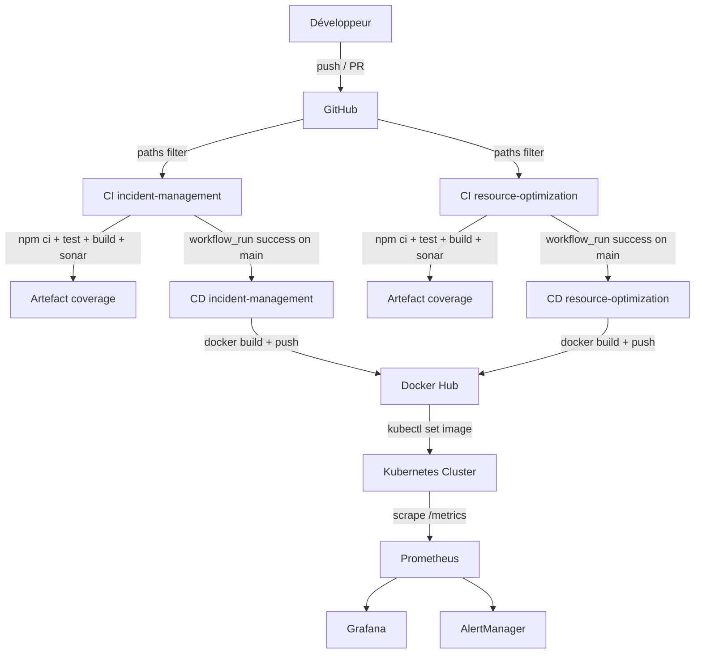
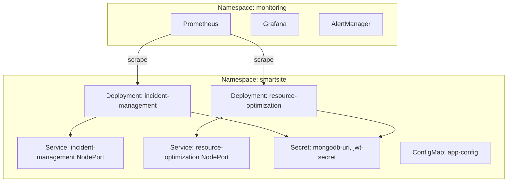

# Document de Conception Technique — Infrastructure DevOps CI/CD

## Vue d'ensemble

Ce document décrit la conception technique de l'infrastructure DevOps CI/CD pour la **SmartSite Platform**. L'objectif est de mettre en place des pipelines d'intégration et de déploiement continus, une analyse de qualité de code, une orchestration Kubernetes et un système de monitoring pour deux microservices NestJS :

- `apps/backend/incident-management` — TypeScript module `nodenext`, Jest 30, ts-jest 29
- `apps/backend/resource-optimization` — TypeScript CommonJS, path aliases `@/`, Jest 29, ts-jest, tsc-alias

### Périmètre

| Composant | Technologie |
|---|---|
| Pipelines CI/CD | GitHub Actions |
| Qualité du code | SonarQube |
| Conteneurisation | Docker multi-stage |
| Orchestration | Kubernetes (kubeadm) |
| Monitoring | Prometheus + Grafana + AlertManager |
| Tests unitaires | Jest + ts-jest |
| Métriques applicatives | @willsoto/nestjs-prometheus |

---

## Architecture

### Vue globale du pipeline CI/CD



### Architecture Kubernetes



---

## Composants et Interfaces

### 1. Pipelines GitHub Actions

#### 1.1 CI — incident-management (`.github/workflows/ci-incident-management.yml`)

**Déclencheur :** push ou PR sur `main`/`develop` avec modifications dans `apps/backend/incident-management/**`

**Étapes :**
1. `actions/checkout@v4`
2. `actions/setup-node@v4` — Node 20, cache npm
3. `npm ci` (working-directory: `apps/backend/incident-management`)
4. `npm test -- --coverage`
5. `actions/upload-artifact@v4` — rapport LCOV, retention 7 jours
6. `sonarsource/sonarqube-scan-action@v5`
7. `npm run build`

**Décision de conception :** Le step SonarQube est placé après les tests pour disposer du rapport LCOV, mais avant le build pour ne pas bloquer l'analyse si le build échoue.

#### 1.2 CI — resource-optimization (`.github/workflows/ci-resource-optimization.yml`)

**Déclencheur :** push ou PR sur `main`/`develop` avec modifications dans `apps/backend/resource-optimization/**`

**Étapes :** identiques à 1.1, avec `working-directory: apps/backend/resource-optimization`

**Particularité :** La résolution des path aliases `@/` est gérée par `moduleNameMapper` dans `jest.config.js` — aucune configuration supplémentaire dans le pipeline.

#### 1.3 CD — incident-management (`.github/workflows/cd-incident-management.yml`)

**Déclencheur :** `workflow_run` sur `CI incident-management`, branches `[main]`, types `[completed]`

**Condition globale :** `if: github.event.workflow_run.conclusion == 'success'`

**Étapes :**
1. `actions/checkout@v4`
2. `docker/login-action@v3` — secrets `DOCKER_USERNAME`, `DOCKER_PASSWORD`
3. `docker build` — tags `latest` + `${{ github.sha }}`
4. `docker push` (les deux tags)
5. `kubectl set image` — secret `KUBECONFIG`
6. Message de confirmation

#### 1.4 CD — resource-optimization (`.github/workflows/cd-resource-optimization.yml`)

**Déclencheur :** `workflow_run` sur `CI resource-optimization`, branches `[main]`, types `[completed]`

Structure identique à 1.3.

---

### 2. Configuration Jest

#### 2.1 jest.config.js — incident-management (à créer)

**Contrainte clé :** TypeScript `module: nodenext` est incompatible avec la transformation ESM par défaut de ts-jest. La solution est d'utiliser `isolatedModules: true` qui désactive la vérification de type complète mais permet la transformation rapide sans résolution de modules ESM.

```js
// apps/backend/incident-management/jest.config.js
module.exports = {
  moduleFileExtensions: ['js', 'json', 'ts'],
  rootDir: 'src',
  testRegex: '.*\\.spec\\.ts$',
  transform: {
    '^.+\\.ts$': ['ts-jest', {
      tsconfig: 'tsconfig.json',
      isolatedModules: true,
    }],
  },
  collectCoverageFrom: ['**/*.(t|j)s'],
  coverageDirectory: '../coverage',
  coverageReporters: ['lcov', 'text'],
  testEnvironment: 'node',
};
```

**Pourquoi `isolatedModules: true` ?** Avec `module: nodenext`, TypeScript exige des extensions `.js` dans les imports, ce qui est incompatible avec Jest. `isolatedModules: true` contourne ce problème en traitant chaque fichier indépendamment.

#### 2.2 jest.config.js — resource-optimization (à modifier)

Ajout de `moduleNameMapper` pour les aliases `@/` et de `coverageReporters` pour LCOV :

```js
// apps/backend/resource-optimization/jest.config.js
export default {
  moduleFileExtensions: ['js', 'json', 'ts'],
  rootDir: 'src',
  testRegex: '.*\\.spec\\.ts$',
  transform: {
    '^.+\\.(t|j)s$': 'ts-jest',
  },
  moduleNameMapper: {
    '^@/(.*)$': '<rootDir>/$1',
  },
  collectCoverageFrom: ['**/*.(t|j)s'],
  coverageDirectory: '../coverage',
  coverageReporters: ['lcov', 'text'],
  testEnvironment: 'node',
  roots: ['<rootDir>', '<rootDir>/../test'],
};
```

---

### 3. Tests unitaires

#### 3.1 incident-management — IncidentsService

Fichier : `src/incidents/incidents.service.spec.ts`

**Stratégie de mock :** Le modèle Mongoose `Model<IncidentDocument>` est mocké via `@nestjs/testing` avec `getModelToken`. Chaque méthode Mongoose (`find`, `findById`, `findByIdAndUpdate`, `findByIdAndDelete`) est remplacée par un `jest.fn()` retournant un objet avec `.exec()`.

```typescript
// Pattern de mock Mongoose pour nodenext
const mockIncidentModel = {
  find: jest.fn().mockReturnValue({ exec: jest.fn().mockResolvedValue([]) }),
  findById: jest.fn().mockReturnValue({ exec: jest.fn().mockResolvedValue(null) }),
  findByIdAndUpdate: jest.fn().mockReturnValue({ exec: jest.fn() }),
  findByIdAndDelete: jest.fn().mockReturnValue({ exec: jest.fn() }),
  save: jest.fn(),
};
```

**Cas de test :**
- `findAll` : retourne un tableau d'incidents
- `findOne` (succès) : retourne l'incident correspondant à l'id
- `findOne` (échec) : lève `NotFoundException` si `findById` retourne `null`
- `create` : crée et sauvegarde un nouvel incident
- `update` (succès) : met à jour et retourne l'incident modifié
- `update` (échec) : lève `NotFoundException` si `findByIdAndUpdate` retourne `null`
- `remove` (succès) : retourne `{ removed: true }`
- `remove` (échec) : lève `NotFoundException` si `findByIdAndDelete` retourne `null`

#### 3.2 incident-management — IncidentsController

Fichier : `src/incidents/incidents.controller.spec.ts`

**Stratégie :** `IncidentsService` est mocké entièrement. Chaque méthode du contrôleur est testée en vérifiant que la méthode de service correspondante est appelée avec les bons arguments.

#### 3.3 resource-optimization — RecommendationService

Fichier : `src/modules/recommendation/recommendation.service.spec.ts`

**Stratégie de mock :** `Model<Recommendation>` et `HttpService` sont mockés. `HttpService` est mocké pour éviter les appels réseau réels vers les autres microservices.

```typescript
const mockRecommendationModel = {
  find: jest.fn().mockReturnValue({ sort: jest.fn().mockReturnValue({ exec: jest.fn() }) }),
  findById: jest.fn().mockReturnValue({ exec: jest.fn() }),
  findByIdAndUpdate: jest.fn().mockReturnValue({ exec: jest.fn() }),
  findByIdAndDelete: jest.fn().mockReturnValue({ exec: jest.fn() }),
};

const mockHttpService = {
  axiosRef: { get: jest.fn() },
};
```

**Cas de test :**
- `create` : crée une recommandation avec status `pending`
- `findAll` : retourne toutes les recommandations, filtrées par `siteId` et `status`
- `getSummary` : retourne un objet avec les 4 champs requis sous forme de chaînes
- `findOne` : retourne la recommandation ou `null`
- `update` : met à jour et retourne la recommandation
- `remove` : supprime et retourne la recommandation

#### 3.4 resource-optimization — RecommendationController

Fichier : `src/modules/recommendation/recommendation.controller.spec.ts`

**Stratégie :** `RecommendationService` est mocké. Tests des routes principales : `POST /`, `GET /`, `GET /site/:siteId/summary`, `GET /:id`, `PUT /:id/status`.

---

### 4. Dockerfiles multi-stage

#### 4.1 Dockerfile — incident-management

```dockerfile
# Stage 1: Build
FROM node:20-alpine AS builder
WORKDIR /app
COPY package.json package-lock.json ./
RUN npm ci
COPY . .
RUN npm run build

# Stage 2: Production
FROM node:20-alpine AS production
WORKDIR /app
COPY package.json package-lock.json ./
RUN npm ci --only=production
COPY --from=builder /app/dist ./dist
EXPOSE 3005
ENV NODE_ENV=production
CMD ["node", "dist/main.js"]
```

**Note `nodenext` :** Avec `module: nodenext`, NestJS génère des fichiers `.js` avec des imports ESM. Le `CMD` utilise `dist/main.js` (pas `dist/main`). Aucun `tsc-alias` n'est nécessaire car il n'y a pas de path aliases.

#### 4.2 Dockerfile — resource-optimization

```dockerfile
# Stage 1: Build
FROM node:20-alpine AS builder
WORKDIR /app
COPY package.json package-lock.json ./
RUN npm ci
COPY . .
RUN npm run build

# Stage 2: Production
FROM node:20-alpine AS production
WORKDIR /app
COPY package.json package-lock.json ./
RUN npm ci --only=production
COPY --from=builder /app/dist ./dist
EXPOSE 3006
ENV NODE_ENV=production
CMD ["node", "dist/main"]
```

**Note `tsc-alias` :** Le script `npm run build` inclut `tsc-alias -p tsconfig.build.json` qui réécrit les imports `@/` en chemins relatifs dans le dossier `dist/`. L'image de production n'a donc pas besoin de `tsconfig-paths` à l'exécution.

---

### 5. SonarQube

#### 5.1 sonar-project.properties — incident-management

```properties
sonar.projectKey=smartsite-incident-management
sonar.projectName=SmartSite - Incident Management
sonar.projectVersion=1.0
sonar.sources=src
sonar.exclusions=**/*.spec.ts,**/*.test.ts,**/node_modules/**,**/dist/**
sonar.tests=src
sonar.test.inclusions=**/*.spec.ts
sonar.javascript.lcov.reportPaths=coverage/lcov.info
sonar.typescript.lcov.reportPaths=coverage/lcov.info
sonar.typescript.tsconfigPath=tsconfig.json
```

#### 5.2 sonar-project.properties — resource-optimization

```properties
sonar.projectKey=smartsite-resource-optimization
sonar.projectName=SmartSite - Resource Optimization
sonar.projectVersion=1.0
sonar.sources=src
sonar.exclusions=**/*.spec.ts,**/*.test.ts,**/node_modules/**,**/dist/**
sonar.tests=src
sonar.test.inclusions=**/*.spec.ts
sonar.javascript.lcov.reportPaths=coverage/lcov.info
sonar.typescript.lcov.reportPaths=coverage/lcov.info
sonar.typescript.tsconfigPath=tsconfig.json
```

#### 5.3 Étape SonarQube dans les pipelines CI

```yaml
- name: Analyse SonarQube
  uses: sonarsource/sonarqube-scan-action@v5
  with:
    projectBaseDir: apps/backend/incident-management
  env:
    SONAR_TOKEN: ${{ secrets.SONAR_TOKEN }}
    SONAR_HOST_URL: ${{ secrets.SONAR_HOST_URL }}
```

---

### 6. Manifestes Kubernetes

#### 6.1 Deployment — incident-management

```yaml
# k8s/incident-management/deployment.yaml
apiVersion: apps/v1
kind: Deployment
metadata:
  name: incident-management
  namespace: smartsite
spec:
  replicas: 1
  selector:
    matchLabels:
      app: incident-management
  template:
    metadata:
      labels:
        app: incident-management
    spec:
      containers:
        - name: incident-management
          image: $DOCKER_USERNAME/incident-management:latest
          ports:
            - containerPort: 3005
          envFrom:
            - secretRef:
                name: incident-management-secret
          resources:
            requests:
              memory: "128Mi"
              cpu: "100m"
            limits:
              memory: "256Mi"
              cpu: "500m"
```

#### 6.2 Service — incident-management

```yaml
# k8s/incident-management/service.yaml
apiVersion: v1
kind: Service
metadata:
  name: incident-management
  namespace: smartsite
spec:
  type: NodePort
  selector:
    app: incident-management
  ports:
    - port: 3005
      targetPort: 3005
      nodePort: 30005
```

#### 6.3 Deployment — resource-optimization

Structure identique à 6.1, avec `name: resource-optimization`, `containerPort: 3006`, et `secretRef: resource-optimization-secret`.

#### 6.4 Service — resource-optimization

Structure identique à 6.2, avec `name: resource-optimization`, `port: 3006`, `nodePort: 30006`.

---

### 7. Monitoring

#### 7.1 Intégration Prometheus dans NestJS

Chaque microservice expose un endpoint `/metrics` via `@willsoto/nestjs-prometheus` :

```typescript
// app.module.ts
import { PrometheusModule } from '@willsoto/nestjs-prometheus';

@Module({
  imports: [
    PrometheusModule.register({
      defaultMetrics: { enabled: true },
      path: '/metrics',
    }),
  ],
})
export class AppModule {}
```

#### 7.2 Configuration Prometheus

```yaml
# k8s/monitoring/prometheus-config.yaml
scrape_configs:
  - job_name: 'incident-management'
    static_configs:
      - targets: ['incident-management.smartsite.svc.cluster.local:3005']
    metrics_path: '/metrics'
    scrape_interval: 15s

  - job_name: 'resource-optimization'
    static_configs:
      - targets: ['resource-optimization.smartsite.svc.cluster.local:3006']
    metrics_path: '/metrics'
    scrape_interval: 15s
```

#### 7.3 Règles AlertManager

```yaml
# k8s/monitoring/alertmanager-config.yaml
groups:
  - name: microservices
    rules:
      - alert: HighCPUUsage
        expr: rate(container_cpu_usage_seconds_total[2m]) > 0.8
        for: 2m
        labels:
          severity: warning
        annotations:
          summary: "CPU > 80% sur {{ $labels.pod }}"

      - alert: HighMemoryUsage
        expr: container_memory_usage_bytes / container_spec_memory_limit_bytes > 0.85
        for: 2m
        labels:
          severity: warning

      - alert: CrashLoopBackOff
        expr: kube_pod_container_status_waiting_reason{reason="CrashLoopBackOff"} == 1
        for: 0m
        labels:
          severity: critical

      - alert: High5xxRate
        expr: rate(http_requests_total{status=~"5.."}[5m]) / rate(http_requests_total[5m]) > 0.05
        for: 5m
        labels:
          severity: critical

      - alert: ServiceUnavailable
        expr: up{job=~"incident-management|resource-optimization"} == 0
        for: 5m
        labels:
          severity: critical
```

---

## Modèles de données

### Structure des fichiers à créer

```
.github/workflows/
  ci-incident-management.yml
  cd-incident-management.yml
  ci-resource-optimization.yml
  cd-resource-optimization.yml

apps/backend/incident-management/
  jest.config.js                          (à créer)
  nest-cli.json                           (à créer)
  Dockerfile                              (à créer)
  sonar-project.properties                (à créer)
  src/incidents/
    incidents.service.spec.ts             (à créer)
    incidents.controller.spec.ts          (à créer)

apps/backend/resource-optimization/
  jest.config.js                          (à modifier)
  Dockerfile                              (à créer)
  sonar-project.properties                (à créer)
  src/modules/recommendation/
    recommendation.service.spec.ts        (à créer)
    recommendation.controller.spec.ts     (à créer)

k8s/
  incident-management/
    deployment.yaml
    service.yaml
  resource-optimization/
    deployment.yaml
    service.yaml
  monitoring/
    prometheus-config.yaml
    alertmanager-config.yaml
```

### Secrets GitHub requis

| Secret | Usage |
|---|---|
| `DOCKER_USERNAME` | Authentification Docker Hub |
| `DOCKER_PASSWORD` | Authentification Docker Hub |
| `KUBECONFIG` | Accès au cluster Kubernetes |
| `SONAR_TOKEN` | Authentification SonarQube |
| `SONAR_HOST_URL` | URL de l'instance SonarQube |

### Secrets Kubernetes requis

| Secret | Clés | Microservice |
|---|---|---|
| `incident-management-secret` | `MONGODB_URI`, `PORT` | incident-management |
| `resource-optimization-secret` | `MONGODB_URI`, `PORT`, `JWT_SECRET` | resource-optimization |

---

## Propriétés de correction

*Une propriété est une caractéristique ou un comportement qui doit être vrai pour toutes les exécutions valides d'un système — essentiellement, un énoncé formel de ce que le système doit faire. Les propriétés servent de pont entre les spécifications lisibles par l'humain et les garanties de correction vérifiables par machine.*

### Évaluation de l'applicabilité du PBT

Ce projet est principalement de l'infrastructure (GitHub Actions, Kubernetes, Docker) et de la configuration. La majorité des critères d'acceptation concernent des comportements de pipelines CI/CD, de configuration YAML et d'infrastructure — domaines où le PBT n'est pas approprié.

Cependant, trois propriétés fonctionnelles sont identifiées comme testables par PBT :

1. La résolution des path aliases `@/` dans les tests Jest (logique de configuration)
2. Le comportement de `NotFoundException` pour les identifiants invalides (logique métier)
3. La structure de retour de `getSummary` (logique de transformation de données)

### Propriété 1 : Résolution des path aliases dans Jest

*Pour tout* module TypeScript du microservice `resource-optimization` utilisant l'alias `@/` dans ses imports, Jest doit pouvoir résoudre et importer ce module sans erreur `Cannot find module`.

**Validates: Requirements 2.8, 10.6**

### Propriété 2 : NotFoundException pour identifiants invalides

*Pour tout* identifiant de chaîne qui ne correspond à aucun document dans la base de données (simulée par un mock retournant `null`), les méthodes `findOne` et `remove` du service `IncidentsService` doivent rejeter avec une instance de `NotFoundException`.

**Validates: Requirements 9.5**

### Propriété 3 : Structure de retour de getSummary

*Pour tout* `siteId` valide, la méthode `getSummary` du service `RecommendationService` doit retourner un objet contenant exactement les champs `totalPotentialSavings`, `approvedSavings`, `realizedSavings` et `totalCO2Reduction`, tous de type `string`.

**Validates: Requirements 10.5**

---

## Gestion des erreurs

### Erreurs de pipeline CI

| Scénario | Comportement attendu |
|---|---|
| Tests Jest échouent | Pipeline marqué comme échoué, CD non déclenché |
| Build NestJS échoue | Pipeline marqué comme échoué |
| Quality Gate SonarQube non atteint | Pipeline marqué comme échoué (si configuré) |
| Rapport LCOV absent | SonarQube analyse sans couverture, pipeline continue |

### Erreurs de pipeline CD

| Scénario | Comportement attendu |
|---|---|
| CI échoué | CD non déclenché (condition `workflow_run.conclusion == 'success'`) |
| Docker build échoue | Pipeline CD échoue, pas de push vers le registry |
| `kubectl set image` échoue | Pipeline CD échoue, alerte à investiguer manuellement |

### Erreurs applicatives

| Scénario | Comportement attendu |
|---|---|
| `findOne` avec id inexistant | `NotFoundException` (HTTP 404) |
| `update` avec id inexistant | `NotFoundException` (HTTP 404) |
| `remove` avec id inexistant | `NotFoundException` (HTTP 404) |
| Connexion MongoDB échoue | Erreur 500, alerte Prometheus déclenchée |
| Pod en CrashLoopBackOff | Alerte AlertManager envoyée |

### Compatibilité TypeScript nodenext

Le module `nodenext` impose des contraintes spécifiques :
- Les imports doivent utiliser des extensions `.js` en production
- `isolatedModules: true` dans ts-jest contourne ce problème pour les tests
- Le Dockerfile utilise `dist/main.js` (avec extension) pour l'entrée

---

## Stratégie de tests

### Tests unitaires

**Bibliothèques :** Jest + ts-jest + @nestjs/testing

**Couverture cible :** ≥ 60% sur `src/**/*.ts` pour chaque microservice

**Approche :**
- Mocks Mongoose via `getModelToken` de `@nestjs/testing`
- Pas de connexion réelle à MongoDB
- Tests des cas nominaux et des cas d'erreur (`NotFoundException`)
- Isolation complète des dépendances externes (`HttpService` mocké)

### Tests de propriétés (PBT)

**Bibliothèque recommandée :** `fast-check` (compatible Jest, TypeScript natif)

**Configuration :** Minimum 100 itérations par propriété

**Tag de référence :** `// Feature: devops-cicd-infrastructure, Property N: <texte>`

**Propriété 1 — Résolution des aliases :**
```typescript
// Feature: devops-cicd-infrastructure, Property 1: résolution path aliases @/
it.each(/* modules utilisant @/ */)('résout %s sans erreur', async (modulePath) => {
  await expect(import(modulePath)).resolves.toBeDefined();
});
```

**Propriété 2 — NotFoundException :**
```typescript
// Feature: devops-cicd-infrastructure, Property 2: NotFoundException pour id invalide
import fc from 'fast-check';
it('lève NotFoundException pour tout id inexistant', async () => {
  await fc.assert(fc.asyncProperty(fc.string(), async (id) => {
    mockModel.findById.mockReturnValue({ exec: jest.fn().mockResolvedValue(null) });
    await expect(service.findOne(id)).rejects.toThrow(NotFoundException);
  }));
});
```

**Propriété 3 — Structure getSummary :**
```typescript
// Feature: devops-cicd-infrastructure, Property 3: structure getSummary
import fc from 'fast-check';
it('getSummary retourne toujours les 4 champs string', async () => {
  await fc.assert(fc.asyncProperty(fc.string({ minLength: 1 }), async (siteId) => {
    mockModel.find.mockReturnValue({ sort: jest.fn().mockReturnValue({ exec: jest.fn().mockResolvedValue([]) }) });
    const result = await service.getSummary(siteId);
    expect(typeof result.totalPotentialSavings).toBe('string');
    expect(typeof result.approvedSavings).toBe('string');
    expect(typeof result.realizedSavings).toBe('string');
    expect(typeof result.totalCO2Reduction).toBe('string');
  }));
});
```

### Tests d'intégration

- Vérification que `coverage/lcov.info` est généré après `npm test -- --coverage`
- Vérification que `docker build` produit une image qui démarre sans erreur
- Vérification que `node dist/main.js` (incident-management) démarre sans erreur de résolution de module
- Vérification que `node dist/main` (resource-optimization) démarre sans erreur de résolution d'alias

### Tests de smoke

- Vérification de la présence des steps requis dans les fichiers YAML des pipelines
- Vérification que `retention-days >= 7` dans les steps `upload-artifact`
- Vérification de l'absence de `continue-on-error: true` sur les steps critiques
