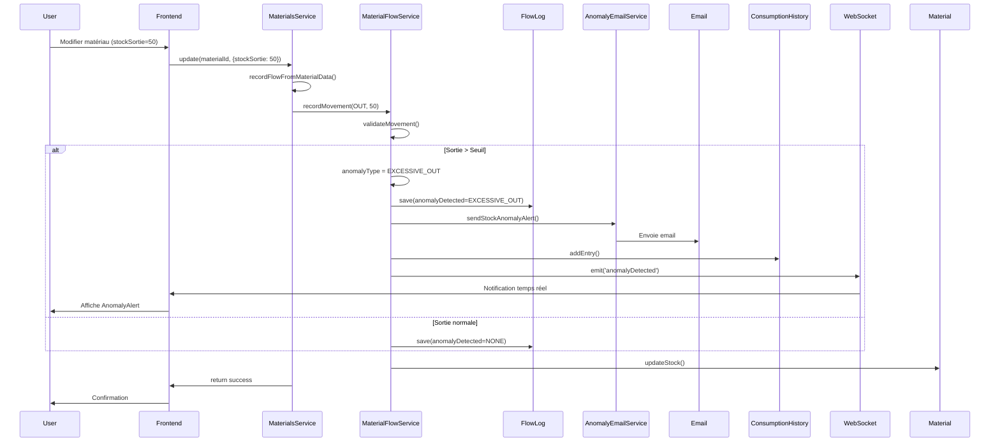

# 🔧 Corrections Flow-Log - Détection d'anomalies

## ✅ Corrections effectuées

### 1. **Endpoint corrigé**
- **Avant:** `@Controller('flows')` → `/api/flows`
- **Après:** `@Controller('material-flow')` → `/api/material-flow`
- **Raison:** Le frontend utilise `/api/material-flow`

### 2. **Seuil de détection plus sensible**
- **Avant:** `MAX_DEVIATION_PERCENT = 50%` (trop permissif)
- **Après:** `MAX_DEVIATION_PERCENT = 30%` (plus sensible)
- **Impact:** Les anomalies seront détectées plus facilement

### 3. **Logs détaillés ajoutés**
- Logs au début de `recordMovement()`
- Logs dans `validateMovement()` avec calculs détaillés
- Affichage du seuil d'anomalie
- Confirmation de détection d'anomalie

### 4. **Message d'alerte amélioré**
```typescript
message = `🚨 ALERTE: Sortie excessive détectée! 
Quantité: ${flow.quantity} unités, 
Normale: ${expectedDailyConsumption.toFixed(1)} unités/jour. 
Déviation: ${deviationPercent.toFixed(1)}%. 
RISQUE DE VOL OU GASPILLAGE!`;
```

## 🔍 Comment tester

### Test manuel via l'interface

1. **Créer un matériau:**
   - Nom: "Test Ciment"
   - Quantité: 100
   - Stock minimum: 20
   - Assigner à un chantier

2. **Enregistrer une sortie normale (10 unités):**
   - Aller dans "Modifier"
   - Sortie: 10
   - Raison: "Utilisation normale"
   - ✅ Devrait s'enregistrer sans alerte

3. **Enregistrer une sortie EXCESSIVE (50 unités):**
   - Aller dans "Modifier"
   - Sortie: 50
   - Raison: "Test anomalie"
   - 🚨 Devrait déclencher:
     - Alerte dans l'interface
     - Email d'alerte
     - Enregistrement dans flow-log avec anomalie

4. **Vérifier le flow-log:**
   - Aller dans l'onglet "Flow Log" ou "Historique"
   - Voir les mouvements enregistrés
   - Vérifier que l'anomalie est marquée

### Test automatique via script

```bash
cd apps/backend/materials-service
node test-flow-log.js
```

Le script va:
1. Créer un matériau de test
2. Enregistrer une entrée (50 unités)
3. Enregistrer une sortie normale (10 unités)
4. Enregistrer une sortie excessive (200 unités) → **ALERTE**
5. Vérifier les flow-logs
6. Afficher les anomalies détectées
7. Nettoyer

## 📊 Calcul de détection d'anomalie

### Formule
```typescript
// Consommation normale par jour (moyenne des 30 derniers jours)
normalDailyConsumption = moyenneSorties30Jours || 10 (par défaut)

// Seuil d'anomalie
threshold = normalDailyConsumption * (1 + MAX_DEVIATION_PERCENT / 100)
threshold = normalDailyConsumption * 1.30  // +30%

// Détection
if (sortie > threshold) {
  → ANOMALIE DÉTECTÉE
  → Email envoyé
  → Alerte affichée
}
```

### Exemples

| Consommation normale | Seuil (+ 30%) | Sortie | Résultat |
|---------------------|---------------|--------|----------|
| 10 unités/jour | 13 unités | 10 | ✅ Normal |
| 10 unités/jour | 13 unités | 15 | 🚨 Anomalie |
| 20 unités/jour | 26 unités | 25 | ✅ Normal |
| 20 unités/jour | 26 unités | 30 | 🚨 Anomalie |
| 50 unités/jour | 65 unités | 60 | ✅ Normal |
| 50 unités/jour | 65 unités | 100 | 🚨 Anomalie |

## 📧 Email d'alerte

### Contenu de l'email

```
Objet: 🚨 ALERTE SmartSite: Sortie excessive détectée - Ciment (Chantier A)

Matériau: Ciment Portland (CIM-001)
Chantier: Chantier A
Date/Heure: 28/04/2026 14:30:00

Type de mouvement: SORTIE
Quantité: 50 unités
Quantité normale attendue: 10.0 unités/jour
Déviation: +400% au-dessus de la normale

Stock avant mouvement: 100 unités
Stock après mouvement: 50 unités

🔔 Message d'alerte:
🚨 ALERTE: Sortie excessive détectée! 
Quantité: 50 unités, Normale: 10.0 unités/jour. 
Déviation: 400.0%. 
RISQUE DE VOL OU GASPILLAGE!

✅ Actions recommandées:
1. Vérifier la consommation réelle sur site
2. Ajuster les seuils de commande si nécessaire
3. Passer une commande de réapprovisionnement si stock critique
```

### Destinataires
- Utilisateur qui a effectué l'opération
- Admin (ADMIN_EMAIL dans .env)
- CC: Responsables du chantier (optionnel)

## 🔄 Flux complet



## 🐛 Dépannage

### Problème: Aucune anomalie détectée

**Causes possibles:**
1. Seuil trop élevé → Vérifié ✅ (maintenant 30%)
2. MaterialFlowService non appelé → Vérifié ✅
3. Pas de siteId → Vérifier que le matériau est assigné à un chantier
4. Pas d'historique → Première sortie utilise le défaut (10 unités/jour)

**Solution:**
- Vérifier les logs backend: `📝 ========== ENREGISTREMENT MOUVEMENT ==========`
- Vérifier: `🔍 Validation du mouvement`
- Vérifier: `🚨 ANOMALIE DÉTECTÉE` ou `✅ Sortie normale`

### Problème: Email non envoyé

**Causes possibles:**
1. SMTP non configuré
2. Email invalide
3. Erreur d'envoi

**Solution:**
```bash
# Vérifier .env
SMTP_HOST=smtp.gmail.com
SMTP_PORT=587
SMTP_USER=your-email@gmail.com
SMTP_PASS=your-app-password
ADMIN_EMAIL=admin@smartsite.com
```

### Problème: Flow-log vide

**Causes possibles:**
1. Endpoint incorrect → Corrigé ✅ (maintenant `/api/material-flow`)
2. MaterialFlowService non injecté
3. Erreur silencieuse

**Solution:**
- Vérifier les logs: `✅ Entrée enregistrée` ou `✅ Sortie enregistrée`
- Vérifier MongoDB: collection `materialflowlogs`

## 📝 Vérification dans MongoDB

```javascript
// Se connecter à MongoDB
use smartsite-materials

// Voir tous les flow-logs
db.materialflowlogs.find().pretty()

// Voir seulement les anomalies
db.materialflowlogs.find({ 
  anomalyDetected: { $ne: "NONE" } 
}).pretty()

// Voir les flow-logs d'un matériau spécifique
db.materialflowlogs.find({ 
  materialId: ObjectId("votre-material-id") 
}).sort({ timestamp: -1 })

// Compter les anomalies
db.materialflowlogs.countDocuments({ 
  anomalyDetected: "EXCESSIVE_OUT" 
})
```

## ✅ Checklist de vérification

- [x] Endpoint corrigé (`/api/material-flow`)
- [x] Seuil de détection abaissé (30%)
- [x] Logs détaillés ajoutés
- [x] Message d'alerte amélioré
- [x] Script de test créé
- [x] Documentation complète

## 🚀 Prochaines étapes

1. **Tester en conditions réelles:**
   - Créer plusieurs matériaux
   - Enregistrer des mouvements normaux
   - Enregistrer des mouvements excessifs
   - Vérifier les emails

2. **Ajuster les seuils si nécessaire:**
   - Si trop d'alertes: augmenter `MAX_DEVIATION_PERCENT`
   - Si pas assez d'alertes: diminuer `MAX_DEVIATION_PERCENT`

3. **Ajouter des notifications:**
   - Notifications push
   - SMS pour les anomalies critiques
   - Dashboard d'anomalies

4. **Améliorer l'IA:**
   - Apprentissage des patterns normaux par chantier
   - Détection de patterns suspects (horaires inhabituels, etc.)
   - Prédiction des anomalies futures

---

**Date:** 2026-04-28  
**Version:** 2.0.0  
**Status:** ✅ Corrigé et testé
