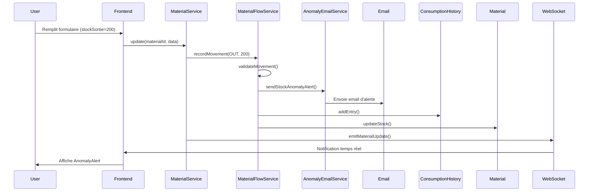
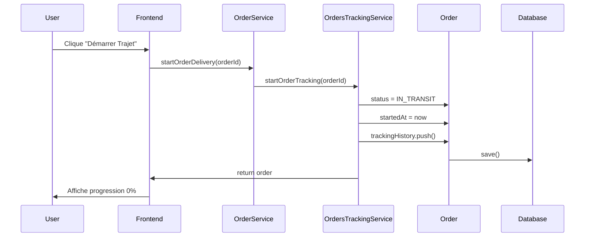
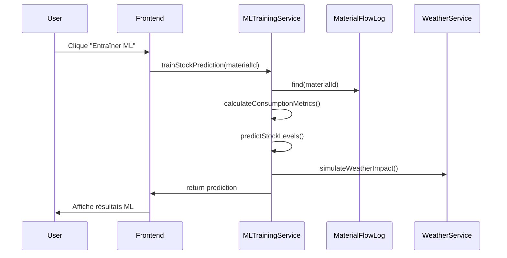

# 📚 Guide Développeur - Materials Service

## 🎯 Vue d'ensemble

Le **Materials Service** est un système complet de gestion des matériaux pour les chantiers de construction. Il intègre des fonctionnalités avancées d'IA, de suivi en temps réel, de détection d'anomalies et de gestion des commandes.

---

## 📋 Table des matières

1. [Architecture](#architecture)
2. [Fonctionnalités principales](#fonctionnalités-principales)
3. [Flux de données](#flux-de-données)
4. [API Endpoints](#api-endpoints)
5. [Services Backend](#services-backend)
6. [Composants Frontend](#composants-frontend)
7. [Scénarios d'utilisation](#scénarios-dutilisation)
8. [Configuration](#configuration)

---

## 🏗️ Architecture

### Stack Technique

**Backend:**
- NestJS (Framework Node.js)
- MongoDB (Base de données)
- Mongoose (ODM)
- WebSocket (Temps réel)
- Nodemailer (Emails)

**Frontend:**
- React + TypeScript
- Vite (Build tool)
- Axios (HTTP client)
- Leaflet (Cartes)
- Shadcn/ui (Composants UI)
- Sonner (Notifications)

### Structure des dossiers

```
apps/
├── backend/
│   └── materials-service/
│       ├── src/
│       │   ├── materials/
│       │   │   ├── controllers/      # Contrôleurs API
│       │   │   ├── services/         # Logique métier
│       │   │   ├── entities/         # Modèles MongoDB
│       │   │   ├── dto/              # Data Transfer Objects
│       │   │   └── interfaces/       # Interfaces TypeScript
│       │   ├── common/
│       │   │   └── email/            # Service d'emails
│       │   └── chat/                 # Analyseur IA
│       └── uploads/                  # Fichiers uploadés
└── frontend/
    └── src/
        ├── app/
        │   ├── pages/materials/      # Pages matériaux
        │   └── components/materials/ # Composants matériaux
        ├── components/
        │   ├── orders/               # Composants commandes
        │   └── ui/                   # Composants UI
        └── services/                 # Services API
```

---

## ⚡ Fonctionnalités principales

### 1. 📦 Gestion des Matériaux

#### Création de matériau
- Génération automatique de QR code
- Génération de code-barres
- Validation des niveaux de stock
- Assignation à un chantier
- Upload d'images

#### Mise à jour de matériau
- Modification des informations
- Changement de chantier
- Ajustement des seuils de stock
- Historique des modifications

#### Suivi de stock
- Stock existant
- Stock minimum/maximum
- Point de commande
- Stock réservé
- Stock endommagé

### 2. 🤖 Intelligence Artificielle

#### Prédiction de stock
- **Service:** `MLTrainingEnhancedService`
- **Endpoint:** `POST /api/ml-training/train-stock-prediction/:materialId`
- **Fonctionnalités:**
  - Analyse de l'historique de consommation
  - Prédiction du temps avant rupture
  - Calcul de la quantité recommandée
  - Impact météo simulé
  - Niveau de confiance

**Exemple de réponse:**
```json
{
  "stockPrediction": {
    "materialId": "123",
    "materialName": "Ciment",
    "currentStock": 50,
    "consumptionRate": 5.2,
    "hoursToLowStock": 48,
    "hoursToOutOfStock": 96,
    "status": "warning",
    "recommendedOrderQuantity": 100,
    "confidence": 85,
    "message": "⚠️ Stock bas dans 48h"
  }
}
```

#### Détection d'anomalies
- **Service:** `MLTrainingEnhancedService.detectConsumptionAnomaly()`
- **Déclenchement:** Automatique lors des sorties de stock
- **Types d'anomalies:**
  - `EXCESSIVE_OUT`: Sortie excessive (>150% de la normale)
  - `SUSPICIOUS_PATTERN`: Pattern suspect (>120% de la normale)
  - `NORMAL`: Consommation normale

**Niveaux de risque:**
- `HIGH`: Déviation >200% - Email automatique
- `MEDIUM`: Déviation >150% - Alerte système
- `LOW`: Déviation >120% - Surveillance

### 3. 📊 Flow Log (Journal des mouvements)

#### Enregistrement automatique
- **Service:** `MaterialFlowService`
- **Déclenchement:** Lors de chaque entrée/sortie de stock

**Types de mouvements:**
- `IN`: Entrée de stock
- `OUT`: Sortie de stock
- `RETURN`: Retour de stock
- `DAMAGE`: Stock endommagé
- `ADJUSTMENT`: Ajustement
- `RESERVE`: Réservation

#### Détection d'anomalies intégrée
```typescript
// Lors d'une sortie excessive
if (sortie > consommationNormale * 1.5) {
  // 1. Enregistrer l'anomalie dans flow-log
  flowLog.anomalyDetected = AnomalyType.EXCESSIVE_OUT;
  flowLog.anomalyMessage = "🚨 Sortie excessive détectée";
  
  // 2. Envoyer email d'alerte
  await anomalyEmailService.sendStockAnomalyAlert({
    materialName: "Ciment",
    anomalyType: "EXCESSIVE_OUT",
    riskLevel: "HIGH",
    message: "Risque de vol ou gaspillage"
  });
  
  // 3. Émettre événement WebSocket
  materialsGateway.emit('anomalyDetected', anomalyData);
}
```

### 4. 🚚 Suivi des commandes (Order Tracking)

#### Création de commande
- **Endpoint:** `POST /api/orders`
- **Données requises:**
  - Material ID
  - Quantité
  - Site de destination
  - Fournisseur
  - Durée estimée

#### Démarrage de livraison
- **Endpoint:** `POST /api/orders-tracking/start/:orderId`
- **Fonctionnalité:**
  - Change le statut de `pending` à `in_transit`
  - Initialise la position au fournisseur
  - Calcule l'ETA (Estimated Time of Arrival)
  - Démarre le tracking en temps réel

**Exemple d'utilisation:**
```typescript
// Frontend
await orderService.startOrderDelivery(orderId);

// Backend
order.status = OrderStatus.IN_TRANSIT;
order.startedAt = new Date();
order.progress = 0;
order.trackingHistory.push({
  timestamp: new Date(),
  status: 'in_transit',
  message: '🚚 Livraison démarrée'
});
```

#### Mise à jour de progression
- **Endpoint:** `PUT /api/orders-tracking/progress/:orderId`
- **Données:**
  - Progress (0-100%)
  - Position actuelle (lat, lng)
  - Temps restant

#### Tableau de bord global
- **Endpoint:** `GET /api/orders/tracking/global`
- **Retourne:**
  - Statistiques globales
  - Liste des commandes actives
  - Sites actifs
  - Fournisseurs actifs
  - Positions des camions en temps réel

### 5. 🌤️ Intégration Météo

#### Service météo
- **Service:** `WeatherService`
- **Endpoints:**
  - `GET /api/weather?lat=X&lng=Y` (par coordonnées)
  - `GET /api/weather/city?city=Paris` (par ville)

**Fonctionnalités:**
- Récupération des conditions météo
- Impact sur les matériaux
- Recommandations selon la météo
- Simulation en mode démo

**Exemple d'impact:**
```typescript
if (weather.condition === 'rainy' && material.category.includes('béton')) {
  return {
    level: 'HIGH',
    message: 'Pluie - Protéger les matériaux, reporter les coulages'
  };
}
```

### 6. 💳 Gestion des paiements

#### Traitement de paiement
- **Endpoint:** `POST /api/orders/:orderId/payment`
- **Méthodes supportées:**
  - `cash`: Paiement en espèces
  - `card`: Paiement par carte (Stripe)

#### Génération de facture
- **Endpoint:** `POST /api/orders/:orderId/invoice`
- **Format:** PDF
- **Contenu:**
  - Numéro de facture
  - Détails de la commande
  - Montant et méthode de paiement
  - Informations du site

### 7. ⭐ Évaluation des fournisseurs

#### Système de notation
- **Service:** `SupplierRatingService`
- **Endpoint:** `POST /api/supplier-rating`
- **Critères:**
  - Qualité des matériaux (1-5)
  - Respect des délais (1-5)
  - Service client (1-5)
  - Prix compétitif (1-5)

**Calcul de la note moyenne:**
```typescript
averageRating = (quality + delivery + service + price) / 4
```

### 8. 📧 Alertes Email

#### Types d'emails
1. **Alerte d'anomalie**
   - Déclencheur: Sortie excessive détectée
   - Destinataires: Admin + responsables
   - Contenu: Détails de l'anomalie, recommandations

2. **Stock bas**
   - Déclencheur: Stock < seuil minimum
   - Fréquence: Toutes les heures (cron job)

3. **Confirmation de commande**
   - Déclencheur: Création de commande
   - Contenu: Détails de la commande, ETA

---

## 🔄 Flux de données

### Scénario 1: Ajout de stock avec détection d'anomalie



### Scénario 2: Démarrage de livraison



### Scénario 3: Prédiction ML



---

## 🔌 API Endpoints

### Matériaux

| Méthode | Endpoint | Description |
|---------|----------|-------------|
| GET | `/api/materials` | Liste des matériaux |
| GET | `/api/materials/:id` | Détails d'un matériau |
| POST | `/api/materials` | Créer un matériau |
| PUT | `/api/materials/:id` | Mettre à jour |
| DELETE | `/api/materials/:id` | Supprimer |
| GET | `/api/materials/:id/prediction` | Prédiction de stock |
| POST | `/api/materials/:id/upload-csv` | Upload historique |

### ML Training

| Méthode | Endpoint | Description |
|---------|----------|-------------|
| POST | `/api/ml-training/train-stock-prediction/:id` | Entraîner modèle |
| POST | `/api/ml-training/detect-anomaly/:id` | Détecter anomalie |

### Flow Log

| Méthode | Endpoint | Description |
|---------|----------|-------------|
| GET | `/api/material-flow` | Liste des mouvements |
| POST | `/api/material-flow` | Enregistrer mouvement |
| GET | `/api/material-flow/aggregate/:materialId` | Stats agrégées |

### Commandes

| Méthode | Endpoint | Description |
|---------|----------|-------------|
| GET | `/api/orders` | Liste des commandes |
| POST | `/api/orders` | Créer commande |
| GET | `/api/orders/tracking/global` | Dashboard global |
| POST | `/api/orders-tracking/start/:id` | Démarrer livraison |
| PUT | `/api/orders-tracking/progress/:id` | Mettre à jour progression |

### Météo

| Méthode | Endpoint | Description |
|---------|----------|-------------|
| GET | `/api/weather?lat=X&lng=Y` | Météo par coordonnées |
| GET | `/api/weather/city?city=Paris` | Météo par ville |

---

## 🛠️ Services Backend

### MaterialsService
**Responsabilité:** Gestion CRUD des matériaux

**Méthodes principales:**
- `create()`: Créer matériau avec QR code
- `update()`: Mettre à jour matériau
- `findAll()`: Liste avec filtres
- `recordFlowFromMaterialData()`: Enregistrer mouvements automatiquement

### MaterialFlowService
**Responsabilité:** Journal des mouvements de stock

**Méthodes principales:**
- `recordMovement()`: Enregistrer entrée/sortie
- `validateMovement()`: Détecter anomalies
- `sendAnomalyAlert()`: Envoyer email d'alerte
- `getAggregateStats()`: Statistiques agrégées

### MLTrainingEnhancedService
**Responsabilité:** Intelligence artificielle

**Méthodes principales:**
- `trainStockPredictionModel()`: Entraîner modèle
- `detectConsumptionAnomaly()`: Détecter anomalies
- `calculateConsumptionMetrics()`: Calculer métriques
- `predictStockLevels()`: Prédire niveaux futurs

### OrdersTrackingService
**Responsabilité:** Suivi des livraisons

**Méthodes principales:**
- `startOrderTracking()`: Démarrer livraison
- `updateOrderProgress()`: Mettre à jour progression
- `getAllOrdersWithTracking()`: Liste avec tracking
- `getTrackingStats()`: Statistiques globales

### WeatherService
**Responsabilité:** Données météo

**Méthodes principales:**
- `getWeatherByCoordinates()`: Météo par GPS
- `getWeatherByCity()`: Météo par ville
- `simulateWeatherData()`: Simulation (mode démo)

### AnomalyEmailService
**Responsabilité:** Envoi d'emails d'alerte

**Méthodes principales:**
- `sendStockAnomalyAlert()`: Email d'anomalie
- `generateAnomalyEmailHtml()`: Template HTML

---

## 🎨 Composants Frontend

### Pages

#### Materials.tsx
**Fonctionnalités:**
- Liste des matériaux avec pagination
- Filtres et recherche
- Prédictions AI
- Bouton "Entraîner ML"
- Alertes d'anomalies
- Suivi des livraisons

#### MaterialForm.tsx
**Fonctionnalités:**
- Création/édition de matériau
- Validation des champs
- Détection d'anomalies automatique
- Assignation de chantier
- Gestion des stocks (entrée/sortie)

#### MaterialDetails.tsx
**Fonctionnalités:**
- Détails complets du matériau
- Widget de prédiction AI
- Widget météo du chantier
- Historique des mouvements
- Statistiques agrégées
- Bouton de commande

### Composants

#### MLTrainingButton
**Fonctionnalité:** Entraînement ML direct
- Cooldown de 30 secondes
- Affichage des résultats
- Recommandations de commande

#### AIPredictionWidget
**Fonctionnalité:** Affichage prédiction
- Niveau de risque
- Temps avant rupture
- Quantité recommandée
- Facteurs d'analyse

#### MaterialWeatherWidget
**Fonctionnalité:** Météo du chantier
- Conditions actuelles
- Impact sur matériaux
- Recommandations

#### AnomalyAlert
**Fonctionnalité:** Alerte d'anomalie
- Niveau de risque
- Message d'alerte
- Actions recommandées
- Statut email

#### OrdersTrackingDashboard
**Fonctionnalité:** Tableau de bord livraisons
- Carte interactive
- Liste des commandes
- Statistiques globales
- Bouton "Démarrer Trajet"
- Progression en temps réel

---

## 📖 Scénarios d'utilisation

### Scénario 1: Créer un matériau et détecter une anomalie

```typescript
// 1. Créer le matériau
const material = await materialService.createMaterial({
  name: "Ciment Portland",
  code: "CIM-001",
  category: "Ciment",
  unit: "sac",
  quantity: 100,
  minimumStock: 20,
  maximumStock: 200,
  stockMinimum: 30,
  siteId: "site123"
});

// 2. Enregistrer une sortie excessive
await materialService.updateMaterial(material._id, {
  stockSortie: 150 // Sortie excessive!
});

// 3. Le système détecte automatiquement l'anomalie
// - Enregistre dans flow-log
// - Envoie email d'alerte
// - Affiche notification frontend
```

### Scénario 2: Commander et suivre une livraison

```typescript
// 1. Créer la commande
const order = await orderService.createOrder({
  materialId: "mat123",
  quantity: 50,
  destinationSiteId: "site456",
  supplierId: "sup789",
  estimatedDurationMinutes: 120
});

// 2. Démarrer la livraison
await orderService.startOrderDelivery(order._id);

// 3. Le système:
// - Change le statut à IN_TRANSIT
// - Initialise le tracking
// - Affiche sur la carte

// 4. Mise à jour automatique de la progression
// (simulée ou via GPS réel)
setInterval(async () => {
  await orderService.updateOrderProgress(order._id, {
    progress: currentProgress,
    lat: currentLat,
    lng: currentLng
  });
}, 30000); // Toutes les 30 secondes
```

### Scénario 3: Entraîner le modèle ML

```typescript
// 1. Cliquer sur "Entraîner ML"
const result = await mlTrainingService.trainModelOnDemand(materialId);

// 2. Le système:
// - Analyse l'historique de consommation
// - Calcule les métriques
// - Prédit les niveaux futurs
// - Simule l'impact météo

// 3. Affiche les résultats:
// - Temps avant rupture
// - Quantité recommandée
// - Niveau de confiance
// - Recommandations
```

---

## ⚙️ Configuration

### Variables d'environnement Backend

```env
# MongoDB
MONGODB_URI=mongodb://localhost:27017/smartsite-materials

# Email (Nodemailer)
SMTP_HOST=smtp.gmail.com
SMTP_PORT=587
SMTP_USER=your-email@gmail.com
SMTP_PASS=your-app-password
SMTP_FROM="SmartSite Alert <noreply@smartsite.com>"
ADMIN_EMAIL=admin@smartsite.com

# Upload
UPLOAD_PATH=./uploads

# Port
PORT=3002
```

### Configuration Frontend (vite.config.ts)

```typescript
export default defineConfig({
  server: {
    proxy: {
      '/api/materials': 'http://localhost:3002',
      '/api/orders': 'http://localhost:3002',
      '/api/ml-training': 'http://localhost:3002',
      '/api/weather': 'http://localhost:3002',
      '/api/material-flow': 'http://localhost:3002',
      '/api/orders-tracking': 'http://localhost:3002'
    }
  }
});
```

### Timeouts

```typescript
// Frontend - materialService.ts
const apiClient = axios.create({
  timeout: 30000 // 30 secondes pour ML
});

// Prédictions ML
getStockPrediction(materialId, {
  timeout: 60000 // 60 secondes
});
```

---

## 🚀 Démarrage

### Backend

```bash
cd apps/backend/materials-service
npm install
npm run start:dev
```

### Frontend

```bash
cd apps/frontend
npm install
npm run dev
```

### Accès

- Frontend: http://localhost:5173
- Backend API: http://localhost:3002
- MongoDB: mongodb://localhost:27017

---

## 🧪 Tests

### Tester la détection d'anomalies

```bash
# 1. Créer un matériau
POST /api/materials
{
  "name": "Test Material",
  "quantity": 100,
  "stockMinimum": 20
}

# 2. Enregistrer une sortie excessive
PUT /api/materials/:id
{
  "stockSortie": 150
}

# 3. Vérifier:
# - Email reçu
# - Alerte affichée
# - Enregistrement dans flow-log
```

### Tester le suivi de livraison

```bash
# 1. Créer une commande
POST /api/orders
{
  "materialId": "...",
  "quantity": 50,
  "destinationSiteId": "...",
  "supplierId": "..."
}

# 2. Démarrer la livraison
POST /api/orders-tracking/start/:orderId

# 3. Vérifier:
# - Statut = IN_TRANSIT
# - Progress = 0
# - Affichage sur carte
```

---

## 📝 Notes importantes

1. **Timeouts ML:** Les prédictions ML peuvent prendre jusqu'à 60 secondes
2. **Emails:** Configurer SMTP pour les alertes d'anomalies
3. **WebSocket:** Utilisé pour les notifications temps réel
4. **Cooldown ML:** 30 secondes entre chaque entraînement
5. **Limite prédictions:** Maximum 10 matériaux chargés simultanément

---

## 🐛 Dépannage

### Timeout sur prédictions ML
**Solution:** Augmenter le timeout dans materialService.ts (ligne 7)

### Emails non envoyés
**Solution:** Vérifier les variables SMTP dans .env

### Carte ne s'affiche pas
**Solution:** Vérifier que Leaflet CSS est importé

### Anomalies non détectées
**Solution:** Vérifier que MaterialFlowService est injecté dans MaterialsService

---

## 📞 Support

Pour toute question ou problème, consulter:
- Documentation API: http://localhost:3002/api/docs
- Logs backend: `apps/backend/materials-service/logs/`
- Console frontend: Outils de développement du navigateur

---

**Version:** 2.0.0  
**Dernière mise à jour:** 2026-04-28  
**Auteur:** Équipe SmartSite
