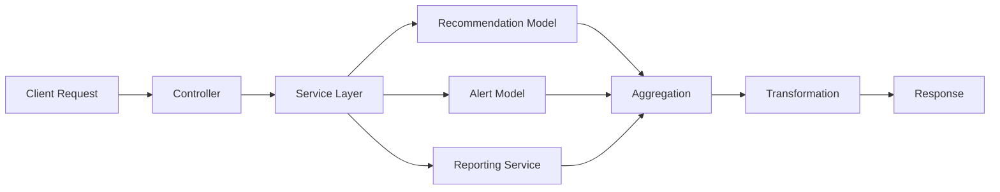

# Power BI Service - Technical Architecture

## Service Overview

The Power BI Service (`PowerBiService`) aggregates and transforms data from multiple sources into a unified dashboard format optimized for real-time visualization and predictive analytics.

## Component Diagram

```
┌─────────────────────────────────────────────────────────┐
│                    PowerBiController                    │
│  GET /dashboard-data/:siteId                            │
│  GET /recommendations-stream/:siteId                     │
│  GET /alerts-stream/:siteId                              │
│  GET /performance-metrics/:siteId?period=                │
└───────────────┬─────────────────────────────────────────┘
                │
                ▼
┌─────────────────────────────────────────────────────────┐
│                   PowerBiService                         │
│  ┌────────────────────────────────────────────────────┐ │
│  │  1. getDashboardData() - Main orchestrator         │ │
│  │     ├── getRealTimeMetrics()                       │ │
│  │     ├── getTrendsData()                            │ │
│  │     ├── calculateKPIs()                            │ │
│  │     ├── getRecommendationsAnalysis()               │ │
│  │     ├── getAlertsAnalysis()                        │ │
│  │     └── getPredictiveInsights()                    │ │
│  └────────────────────────────────────────────────────┘ │
└───────────────┬─────────────────────────────────────────┘
                │
                ├──────────────┬─────────────┬────────────┐
                ▼              ▼             ▼            ▼
    ┌──────────────┐ ┌──────────────┐ ┌──────────┐ ┌──────────┐
    │Recommendation│ │    Alert     │ │Reporting │ │  Other   │
    │   Model      │ │   Model     │ │ Service  │ │ Services │
    └──────────────┘ └──────────────┘ └──────────┘ └──────────┘
```

## Data Aggregation Strategy

### Real-Time Metrics (getRealTimeMetrics)
```typescript
activeRecommendations = count(recommendations where status in ['pending', 'approved'])
pendingApprovals = count(recommendations where status == 'pending')
activeAlerts = count(alerts where status == 'active')
criticalAlerts = count(alerts where severity == 'critical' AND status == 'active')
liveSavings = sum(estimatedSavings where status == 'implemented')
liveCO2Reduction = sum(estimatedCO2Reduction where status == 'implemented')
```

### Trends Data (getTrendsData)
**Time Windows:**
- **30 days**: Recommendations by day (for line/area charts)
- **24 hours**: Alerts by hour (for hourly distribution)
- **4 weeks**: Weekly performance (for trend analysis)

**Grouping Functions:**
- `groupByDate()`: Aggregates by YYYY-MM-DD
- `groupByHour()`: Aggregates by HH:00 buckets
- `calculateWeeklyPerformance()`: Compares week-over-week metrics

### KPI Calculations (calculateKPIs)
```typescript
ROI = (realizedSavings / totalResourcesCost) * 100
EfficiencyScore = (implementedRecommendations / totalRecommendations) * 100
SustainabilityIndex = (actualCO2Reduction / currentCO2Emissions) * 100
BudgetVariance = |equipment% - 40%| + |workers% - 60%|
```

### Recommendations Analysis (getRecommendationsAnalysis)
- **By Type**: Grouped count by recommendation category
- **By Priority**: Grouped into high(8-10)/medium(5-7)/low(1-4)
- **By Status**: Grouped by lifecycle stage
- **Top Performers**: Top 5 implemented recommendations by savings amount

### Alerts Analysis (getAlertsAnalysis)
- **By Type**: Equipment, energy, workforce, etc.
- **By Severity**: Critical, high, medium, low distribution
- **Response Times**: Average hours to resolution (filtered to resolved alerts)

### Predictive Insights (getPredictiveInsights)
**Forecasting Logic:**
1. Calculate average daily savings from last 7 days of implemented recommendations
2. Multiply by 7 for next week projection
3. Apply confidence adjustment based on trend stability

**Risk Detection Rules:**
- `approval_backlog`: >5 pending recommendations → 80% probability, high impact
- `low_roi`: ROI < 50% → 60% probability, medium impact
- Can be extended with ML models in future

**Opportunity Identification:**
- Equipment investment if equipment% < 35%
- Process automation if pending > 3
- Potential savings estimated via historical multipliers

## Data Flow & Caching



## Performance Optimizations

1. **Parallel Queries**: `Promise.all()` for independent data fetches
2. **Date Range Filters**: Only query relevant time periods
3. **Indexed Fields**: Assumes MongoDB indexes on `siteId`, `status`, `createdAt`, `implementedAt`
4. **Cached Results**: TanStack Query handles client-side caching
5. **Streaming Endpoints**: Lightweight endpoints for frequent polling

## Error Handling

- Try-catch blocks with proper logging
- Fallback values for calculations (avoid NaN)
- Graceful degradation when data missing
- Error propagation to controller for HTTP status codes

## Extensibility Points

### Adding New Metrics
1. Extend `PowerBiDashboardData` interface
2. Add calculation method in service
3. Include in `getDashboardData()` return object
4. Create corresponding UI component

### Adding New Predictive Models
1. Create new method in `getPredictiveInsights()`
2. Integrate ML model or statistical analysis
3. Add interface fields for predictions
4. Display in Predictive tab

### Custom Date Ranges
1. Modify `getTrendsData()` to accept `startDate`/`endDate`
2. Add query parameters to endpoint
3. Update frontend to pass user-selected range
4. Add date picker UI

## Monitoring & Logging

- Uses NestJS built-in Logger (`PowerBiService.name`)
- Logs errors with stack traces
- Timestamp all operations for performance tracking
- Consider adding metrics collection for:
  - Query execution time
  - Data freshness
  - Error rates

## Security Considerations

- Endpoints require authentication (handled by route guards in main app)
- Site ID validation in controller
- Rate limiting recommended for streaming endpoints
- Data access control enforced by backend authentication middleware

## Database Queries

### Recommendations Query (Stream)
```javascript
db.recommendations
  .find({ siteId: siteId })
  .sort({ createdAt: -1 })
  .limit(50)
```

### Alerts Query (Stream)
```javascript
db.alerts
  .find({ siteId: siteId, status: 'active' })
  .sort({ createdAt: -1 })
  .limit(20)
```

### Aggregation Queries
Use MongoDB aggregation pipeline for complex grouping:
```javascript
db.recommendations.aggregate([
  { $match: { siteId, createdAt: { $gte: startDate } } },
  { $group: {
    _id: { $dateToString: { format: '%Y-%m-%d', date: '$createdAt' } },
    count: { $sum: 1 },
    savings: { $sum: '$estimatedSavings' }
  }},
  { $sort: { _id: 1 } }
])
```

## Future Enhancements

1. **Materialized Views**: Pre-aggregated data for faster dashboard loads
2. **WebSockets**: Push-based updates instead of polling
3. **Caching Layer**: Redis for storing computed KPIs
4. **Batch Processing**: Nightly rollups for historical data
5. **Data Warehouse**: Snowflake/BigQuery for large-scale analytics
6. **ML Integration**: Python microservice for advanced predictions

## Dependencies & Versions

- NestJS: ^10.0.0
- Mongoose: ^7.0.0
- Axios: ^1.0.0 (for external API calls)
- Recharts: ^2.0.0 (frontend)
- TanStack Query: ^5.0.0 (frontend)

## Testing Strategy

### Unit Tests (Backend)
```typescript
describe('PowerBiService', () => {
  describe('getRealTimeMetrics()', () => {
    it('should calculate correct active recommendations count', () => {})
    it('should sum only implemented savings', () => {})
  });

  describe('getTrendsData()', () => {
    it('should group recommendations by date', () => {})
    it('should bucket alerts by hour', () => {})
  });

  describe('calculateKPIs()', () => {
    it('should compute ROI correctly', () => {})
    it('should handle divide-by-zero edge cases', () => {})
  });
});
```

### Integration Tests
```typescript
describe('PowerBiController (E2E)', () => {
  it('GET /power-bi/dashboard-data/:siteId', () => {
    expect(response.status).toBe(200);
    expect(response.body).toHaveProperty('realTimeMetrics');
    expect(response.body).toHaveProperty('trends');
    // ...
  });
});
```

### Frontend Tests
- Component rendering tests
- Chart data transformation tests
- Hook behavior tests
- Real-time update simulation

## Troubleshooting

### Issue: Dashboard loads slowly
**Solution**: Add MongoDB indexes:
```javascript
db.recommendations.createIndex({ siteId: 1, status: 1, createdAt: -1 })
db.alerts.createIndex({ siteId: 1, status: 1, createdAt: -1 })
```

### Issue: Data appears stale
**Solution**: Check `refetchInterval` configuration, ensure backend caching not too aggressive

### Issue: Charts not rendering
**Solution**: Verify Recharts installation, check data array not empty, ensure numeric values not NaN

### Issue: TypeScript errors
**Solution**: Ensure all types imported from `../types`, run `npm run build` to verify

## Support Contact

For technical questions about this implementation, contact the backend/frontend development teams.